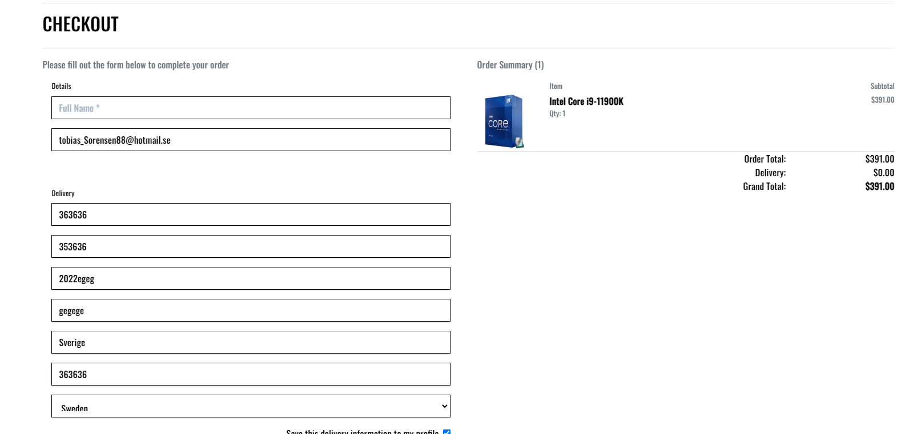

# HardwareGuru
 
Hardwareguru is for people that are looking to upgrade their computers with the latest in PC hardware.
Hardwaregurus motto is cheap prices and fast deliveries and ofcource good service.
Service is important when you decide on new PC parts to get help on what PC hardware works for your pc and gives you the best prestanda per dollar.
We also have reviews on the website from users, so potential buyers can get some extra information on what other users think of the product.
The website is a fully functioning e-commerce website, that is fully responsive and working on all devices. 
[Link to HardwareGuru](https://e-store8.herokuapp.com/)

# UX
The website has been designed with backgrounds and text that makes it easy for anyone to see what's on the page. 
The design is simple but elegant, and easy navigation so the user had no problems in finding their way around to purchase something. 
The site design is very minimalistic but it works good. We use payment via stripe with simple checkout, and Facebook and newsletter subscriptions. 

## colors/text used
Colors automatically generated from [alwane](https://alwane.io/) 
 
And Font family used is Oswald. 

## User Stories

### As a first time visitor I want.

- I want to understand what the website is about at first glance.
- I want a website that has good colors so it's easy to see everything.
- I want a website with a good design that makes me stay.
- I want a website that is easy to navigate through.
- I want to be able to visit the website on any device and it should be responsive.

### As an unregistered visitor i want.

- I want to be able to use the search function on the website to find what am looking for.
- I want to be able to Subscribe to the newsletter.
- I want to be able to visit the socials via the website links.
- I want to be able to contact the shop to ask questions.
- I want to be able to read product reviews.
- I want to be able to buy from the website.
- I want to be able to see the rating of products.
- I want to be able to filter products according to price, category, rated first, and alphabetically.
- I want to be able to see the total cost of my products in my cart.
- I want to see all the products I have in my cart.
- I want to be able to sign up for an account.
- I want to have a popup when purchasing or adding something in the checkout.
- I want to be able to receive an email confirmation of my order.
- I want to be able to view a confirmation of my order once the checkout process is complete.
- I want to be able to add items to my cart.
- I want to see a success message when i sign up for newsletter.
- I want the shop now button to bring me to the products.
- I want the Subscribe button to bring me to the newsletter Signup

### As a registered visitor i want.

- I want to do all the unregistered user stuff except make an account of course cause i already got one.
- I want to be able to edit my profile page.
- I want to be able to see my order history.
- I want to be able to post a product review.
- I want to be able to give my product review comment a rating 1-5 stars.
- I want to be able to edit my review comment.
- I want to be able to change the star rating on my review comment.
- I want to be able to delete my review comment.
- I want to the a success message when I edit my profile.
- I want a conformation email to activate my registered account.

### As a superuser i want to be able to:

- Edit products without going to the admin panel.
- Delete Products without going to the admin panel.
- Add products without going to the admin panel.
- Add new categories via the admin panel.
- Delete users via the admin panel.
- Remove subscribers via the admin panel
- Remove any review via the admin panel.
- Be able to give user admin/super user via the admin panel.
- Be able to read questions that's been sent in via the contact form.

### Siteowner goals for the future

- Is to add some of the superuser features to the website so you don't have to go to admin panel.
- Keep making the E-commerce website better with new updates.
- Make the customer be able to delete their account themselves in the future.
- Adding more payment options than credit card.
- Make the design on the website better.

### I did a Kanban board with github [Kanban Github projects Link to see full kanban HERE](https://github.com/users/tobbe8808/projects/6)  

## Wireframes

### PC frontpage

### PC Products page

### Mobile frontpage

### Mobile productspage

##  Features on the website

### Logo name

### Header with navbar

### My account and shopping bag

### search function

### Frontpage call to action buttons

### Footer with newsletter signup and socials

### Contact form

### Products page

### Sort by on the products page

### Click to scroll all the way up button

### All products sort by navbar dropdown

### Sign in

### Register

### Shopping bag popup on login with items in your bag.

### Product management page

### My profile page

### Shopping bag

### Shopping bag checkout payment

### Order successfully popup

### Order confirmation

### Confirmation Email

### Rating that updates on reviews and edit/delete button for superusers

### Sign Out

### Products detail

### Review comments with edit/delete and star rating

### Comment/Review section

### Delete success popup

### 404 error with return link back to page.

## Business model B2C

My Business model for my E-commerce website is B2C Business to consumer.
The Hardware Guru knows there is a lot of competition in the PC components market, that's why we focus on holding down our prices and give the best service we can to customers.
The absolute biggest value for the customer on our site is that they get the support needed and to ask questions before buying if they are unsure what they want.
It could be what graphics card gives the best preformance of the current parts they have on their PC, or what processor has the most performance for their budget, or even just asking if a part will fit on their motherboard. We also have market competitive prices and free shipping on orders over 75$, but as a small PC shop it's hard to get the lowest prices so we focus to excel in service to get returning customers that value service.
The target consumer is people interested in gaming and video editing cause those are the most normal tasks that require a lot of performance out of your PC.

## Marketing Strategies

As am a small business and don't wanna spend any money on marketing i will use Facebook and email marketing.
Social media I will make a Facebook business page and market my sales and answer questions from people interested in my products, and post updates about the shop posting new incoming products and maybe contests with prices and more, and even use other social platforms. I will use email newsletter as a marketing tool so people that are intrested can sign up and get the newest hotest deals and know first when new products are in stock, and other special offers.
I will also use try to market the website on local sell sites that has free advertisement.
Also i will use my personal facebook to try to get people i know to see the company and mabey get some customers that way.
Its a small business with not alot of money to spend so marketing on socials and free advertisement website is a good way to start a customer base.
example of local Marketing is using Blocket.se its one of swedens most used advertisement website where advertisement is free or in some cases cost very little.

**Facebook mockup business page**

## Data Schema

  
**User model**  
The User model is when a user registers to the website and makes an account. 
The user makes an account with the allauth that fixes djangos authentication. 
The user makes use of their nickname and the password to login.  
**Userprofile model**  
In the user profile the user saves their information like phone number, street address and 
other personal information from the model as in the picture. 
  
**category model**  
The category model is where all the products categories is saved. 
In mine, I got graphics cards, ram, Monitors and processors. 
  
**Order model**  
The order model you use when you are using the checkout and buying. 
The model saves all data from the model like stipe pid, normal user details, order total, delivery cost and others seen in the model. 
  
**Product model**  
The product model is the model that adds all the products on the page with the info price and more and saves it so you can edit them and delete 
It will also show all the products on the website. 
  
**orderlineitem model**  
The orderline items is the products you got in your cart, Its connected with the order model so you can do your purchase. 

  
  

**Review model**  
The review model is the model that saves the review comments and star ratings. 
Like what Product is being rated, the comment, username and the rating given. 
Very close relative to the product model. 

  

**Subscriber model**  
The subscription model is a standalone model. 
It just registers the email the user signsup with for the newsletter and saves it to the database. 

  

**Contact model**  
The contact model is a standalone model. 
It just saves the email, subject and message to the database for the admin to see. 

  

## Deployment to Heroku

1. First go to the Heroku website and make a new app.
2. Choose the region that is closest to you and an app name.
3. On the resources tab in heroku add Postgres free plan as an addon.
4. Go back to gitpod and install dj_database_url and psycopg2-binary with pip3 install.
5. Make sure you freeze the requirements with pip3 freeze > requirements.txt so heroku can get all the data.
6. In settings.py import dj_database_url.
7. Comment out the sqlite database.
8. Add dj_database_url.parse() to the databases.
9. Insert the postgres link inside parse() that you get from settings/config vars in Heroku.
10. Run migrations so its updated to the postgres database.
11. If you used fixtures run /python3 manage.py loaddata categories or whatever you called it.
12. If you got more to add you run the command in 11 again.
13. Make a superuser account for the postgres database.
14. Remove the postgres database and uncomment the sqlite database so it doesn't end up in version control.
15. Commit the changes.
16. Write an if/else statement for the databases to connect to Heroku when in os.environ or else connect to sqlite.
17. Install gunicorn with pip3.
18. Freeze it so gunicorn goes into the requirements.txt
19. Create a Procfile on the main location and add gunicorn code.
20. Login to Heroku in the gitpod terminal.
21. disable collect static with DISABLE_COLLECTSTATIC=1 so heroku doesn't collect static files.
22. Add Heroku url to the ALLOWED_HOSTS in settings.py.
23. Push to github and Heroku, you don't need to push to Heroku if you already have setup auto deployment to Heroku with git push.
24. Generate a django key with a django random secret key generator.
25. Add the random secret key to the Heroku Config Vars.
26. Go back to settings.py and replace the SECRET_KEY with the generated key.
27. Set debug to true only if the environment is a development environment.
28. Commit changes to github/Heroku.
29. Register for an AWS account.
30. Go to s3 and create a new bucket.
31. With the settings you got create the bucket.
32. Turn on static websitehosting on your new bucket.
33. Create and setup the Identify and Access Management(IAM).
34. Install boto3 and Django-storages with pip3 in the Gitpod terminal.
35. Freeze the requirements.txt.
36. connect AWS via your settings.py with if USE_AWS.
37. Go back to Heroku config vars and add the AWS keys, and USE_AWS.
38. Remove collectstatic from Heroku so it will collect them from AWS s3.
39. Create custom_storage.py for media and static files storage code.
40. In settings.py add code to use the static and media storage class and location.
41. Commit and push to github and Heroku.
42. In the s3 bucket make a new folder for your media files.
43. Upload the images to the folder in s3.
44. Add the stipe keys to your Heroku config variables.
45. Create a new webhook endpoint in Stripe so it connects to the deployed site.
46. Add the signing secret to heroku config variables.

**If you dident use fixtures you need to get the data from your Sqlite database.**

47. Make sure you are connected to the sqlite database so you can get the data.
48. Make a backup of the app's data that you want. For the example, we will use the "product" app.
49. Make a backup with the command python3 manage.py dumpdata products > products.json to backup products.
50. Connect yourself to the postgres database.
51. Transfer the backup json file you just created with command python3 manage.py loaddata products.json
52. Now you should see the products in development.

## Search Engine Optimisation (SEO)

I used wordtracker.com to decide what meta tags to use for my search engine optimization. 
I did searches and ended up with the key words that i thought would give the best traffic for me as a small business. 

**Meta tags word used** 

- PC Parts Cheap Prices Fast Delivery.
- We got all the new fresh PC components to market low prices.
- PC parts
- Parts of computer
- Budget gaming PC
- Cpu cheap
- Gpu cheap
- Computer parts
- PC components

## Validator Testing

- The HTML code was tested using W3C HTML Validator.
Only error i got from the HTML was from my vue.js code in picture below.

- The CSS code  was validated using W3C CSS Validator and no errors were returned.
- The JavaScript i used JSHint and no errors were found.
- The python code validated using PEP8. No errors were returned. All PEP8 fixed except settings.py.

## Manual testing

- [x] The shop now button should bring you to the products page so you can see the products on one click.
- [x] The Subscribe button should bring you down to the newsletter signup page.
- [x] All the social media buttons in the footer should have working and open in another browser tab.
- [x] The footer with subscribe to newsletter shouldn't be on any register/login/product management/My profile/logout or the shopping cart.
- [x] All the navbar buttons work and should bring you to the content they are saying they are.
- [x] When you click the Hardware guru text in the top right corner it should bring you back to the main page.
- [x] When you go to the products page all the sort by functions should work as intended price low/high, price high/low, rated first, name A-Z, name Z-A, category A-Z and category Z-A.
- [x] All Products page should also work with soring all categories.
- [x] The contact form should work and on submit save to the database inside admin contacts.
- [x] The newsletter signup works and sends the email to the database inside admin Subscribers.
- [x] The newletter signup won't let you signup with the same email again.
- [x] The search function is working like it should and finds the producs you are searching for.
- [x] The products management lets admin add products and pictures, if no picture it chooses a standard no picture image.
- [x] The admin is allowed to edit products.
- [x] The admin can delete products.
- [x] You can edit your profile page.
- [x] Your order history is saved on my profile page.
- [x] You can click in on your order number and see the order information.
- [x] You can login.
- [x] You can logout.
- [x] You can register an account.
- [x] You can add products to the shopping bag.
- [x] You can add and remove items inside your shopping bag.
- [x] You can see all your items inside the shopping bag.
- [x] No shipping cost is updated on orders over 75$.
- [x] Buying products work.
- [x] Stripe accepts the payment both without verification and with verification.
- [x] You get an order confirmation when you buy something.
- [x] Even if you close down the window before the purchase is done it works and you get an email confirmation and stripe processes the payment.
- [x] When you close the window before the payment is processed it still saves the order to your order history.
- [x] You can see reviews even if you are not registered.
- [x] You can't write reviews if you are not registered.
- [x] You can write reviews as a registered user.
- [x] You can edit your reviews as a registered user.
- [x] You can delete your reviews as a registered user.
- [x] You can't edit/delete other user reviews.
- [x] All forms on the website forces you to enter all needed information.
- [x] When you sign up you get a confirmation email.
- [x] When you try to login without verifying it tells you to verify.
- [x] When you verify you can login.
- [x] The popup when you add items to your cart works.
- [x] The popup when you logout works.
- [x] The popups from the checkout cart works.
- [x] When your order is successfully you get a popup telling you so.
- [x] If you don't complete all fields in the forms it will tell you.
- [x] If your credit card didn't work it will tell you.
- [x] You can't enter any admin section if you got the url, you must be logged in as admin to reach admin places.
- [x] When you get a confirmation email it sais its from Hardwareguru.
- [x] Error 404 page works and brings you back to the website again on the link.
- [x] Error 500 page works and brings you back to the website again on the link.
- [x] The rating is updated when the user submits review.
- [x] The Avrage rating is updated bases on avrage review score.
- [x] All the features from the user stories was also tested.

## Responsive Testing

I used google developer tools to test how responsive the website was. 
I tested all the devices in the below screenshot without problem. 

### Lighthouse testing

I tested all pages in lighthouse with good scores. 

**Frontpage with Desktop lighthouse**

**Frontpage with Mobile lighthouse**

## Coding Languages

- HTML
- CSS
- Javascript
- Python

## Libraries, Frameworks and Hosting Used
- Django
- HerokuSQL
- Markdown
- Django Allauth
- Bootstrap
- Stripe
- jQuery
- Heroku
- Github
- Font Awesome
- AWS
- Git
- vue.js

## Credits/Reference

[Stackoverflow](https://stackoverflow.com/) 
[CodeWithstein](https://www.youtube.com/c/CodeWithStein) 
[Codepen](https://codepen.io/) 
[Ordinarycoders](https://ordinarycoders.com/) 
Code institute Slack. 
Code institutes Project - Boutique Ado. 
Code institutes Tutor Assistance. 
Code institutes Mentor. 

## Images

[pexels](https://www.pexels.com/) 
[newegg](https://www.newegg.com/) 

